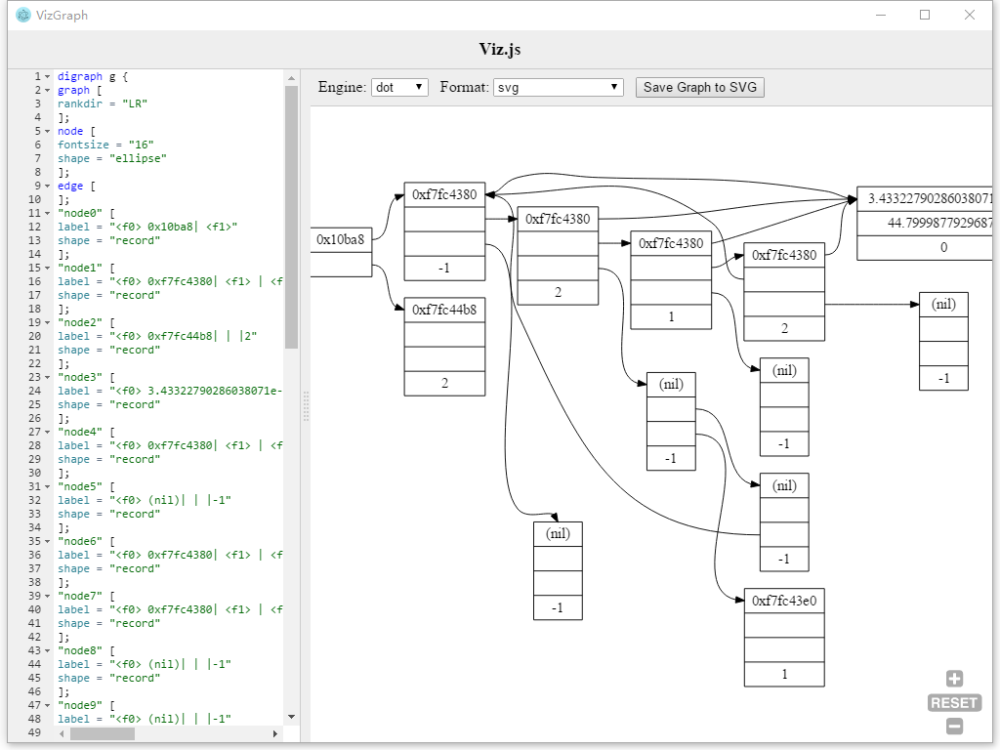
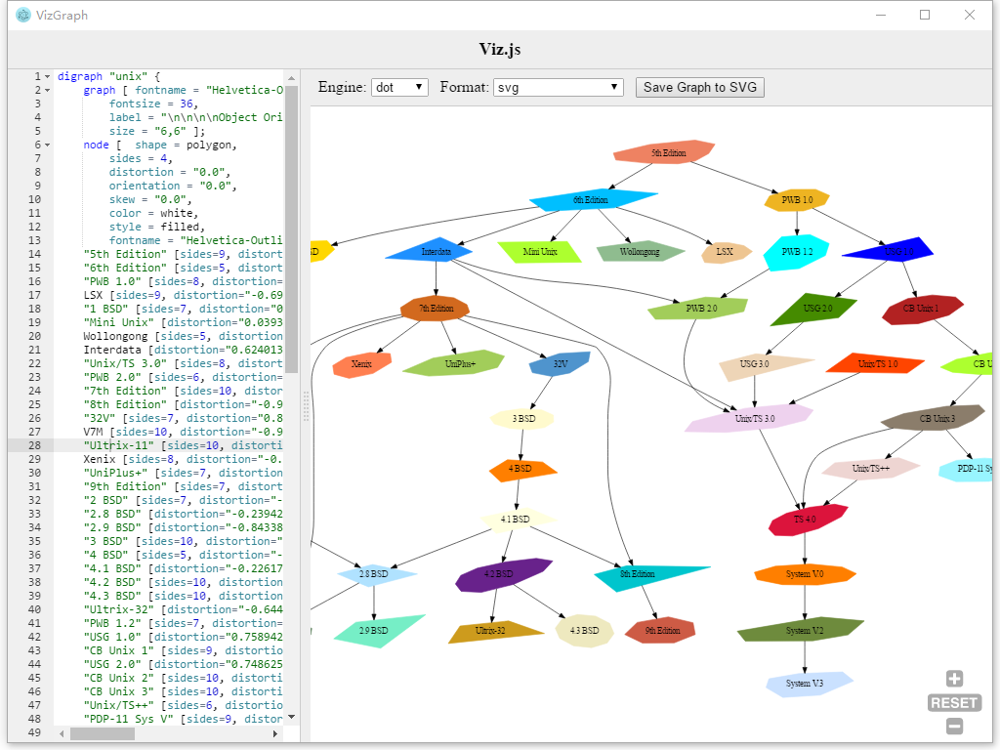

# VizGraph

A simple tool for Using [Graphviz](https://graphviz.gitlab.io/). Based on [Viz.js](https://github.com/mdaines/viz.js) & [Electron](https://github.com/electron/electron).

Sample usage from [Graphviz Gallery](https://graphviz.gitlab.io/gallery/):

---

This project is on its beta release now.